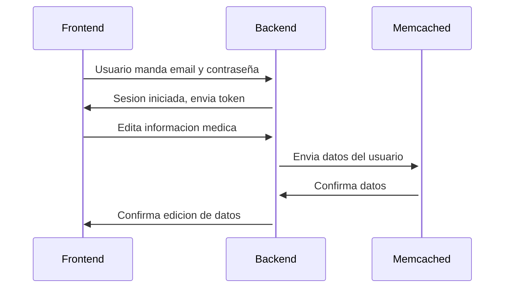

```mermaid
sequenceDiagram
    Frontend->>+Backend: Usuario manda email y contraseña
    Backend->>Frontend: Sesion iniciada, envia token
    Frontend->>Backend: Edita informacion medica
    Backend->>+Memcached: Envia datos del usuario
    Memcached->>Backend: Confirma datos
    Backend->>Frontend: Confirma edicion de datos
```